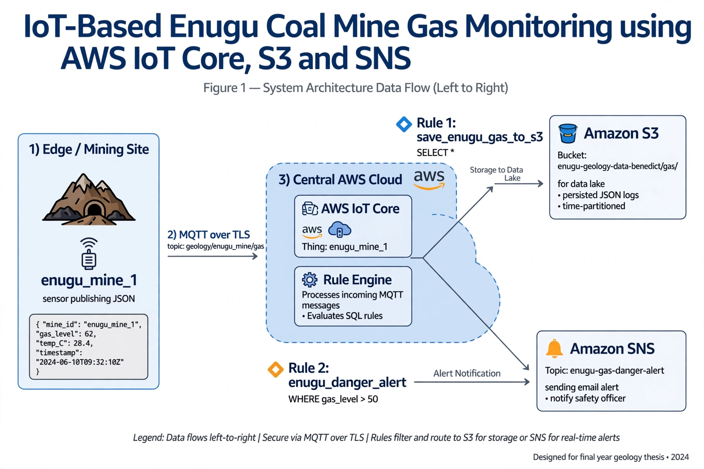

# IoT-Based Gas Monitoring for Enugu Coal Mine - AWS IoT Core, S3, SNS

> Real-time safety monitoring system for Enugu coal mines using AWS Cloud. Detects dangerous gas accumulation and triggers instant email alerts.



Problem Statement
Enugu coal mines face gas accumulation hazards (methane, CO). Manual monitoring is slow, risky, and has no historical data archive for geological analysis. This project provides automated, cloud-based safety monitoring.

Solution Architecture
- **Edge:** Simulated sensor `enugu_mine_1` (real: ESP32 + MQ-2/MQ-4)
- **Ingestion:** AWS IoT Core via MQTT/TLS, topic `geology/enugu_mine/gas`
- **Rule 1 - Storage:** `save_enugu_gas_to_s3`
    - SQL: `SELECT * FROM 'geology/enugu_mine/gas'`
    - Action: S3 Bucket `enugu-geology-data-benedict/gas/` - stores every reading as JSON for long-term geology research
- **Rule 2 - Alert:** `enugu_danger_alert`
    - SQL: `SELECT * FROM 'geology/enugu_mine/gas' WHERE gas_level > 50`
    - Action: Amazon SNS Topic `enugu-gas-danger-alert` → Email notification for evacuation

Data Format
```json
{
  "mine_id": "enugu_mine_1",
  "gas_level": 75,
  "temperature": 40,
  "danger": "HIGH - EVALUATE"
}
Live Test Results (Proof)
- ✅ Normal: `gas_level: 22.1` → Saved to S3 only (83B file)
- ✅ Dangerous: `gas_level: 75` → Saved to S3 + Instant email received via SNS
- ✅ 2 Active IoT Rules, 1 Thing with X.509 cert, MQTT Test Client

Tech Stack
AWS IoT Core, Amazon S3, Amazon SNS, MQTT, JSON, TLS/X.509, ESP32 (future), MQ-2 Sensor (future)

Future Work
- Connect real ESP32 + MQ-2 sensor hardware
- Add AWS Lambda for SMS via Amazon Pinpoint
- Build QuickSight/Grafana dashboard from S3 data
- Infrastructure as Code with Terraform

Author
Benedict - Geologist | AWS IoT & Cloud Monitoring for Mining & Environment
Enugu, Nigeria | Open to Remote IoT / Cloud Support / Mining Tech roles
LinkedIn: [Your LinkedIn URL]
Built as part of 90-Day Geology + Cloud Challenge - Day 3

How to Reproduce
1. Create Thing in AWS IoT Core: `enugu_mine_1`
2. Create S3 bucket and SNS topic
3. Create 2 IoT Rules with SQL above
4. Publish to `geology/enugu_mine/gas` via MQTT test client


